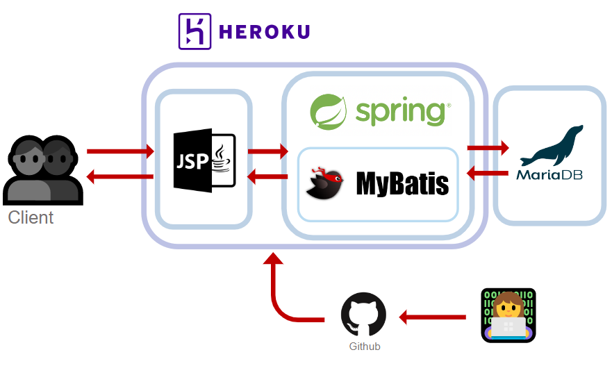

# README.md

---

# 5so4so

> JSP와 Spring을 이용한 쇼핑몰 만들기
>


<aside>
🏬 저희 쇼핑몰은 ‘다이소’와 ‘오늘의 집’을 컨셉으로 가져갔습니다. 다양한 물품들을 저렴한 가격에 팔겠다는 의미에서
오소~~~ 사소~~ (오이소~ 사이소~)
친근하지만 기억에 잘 남을 수 있는 느낌으로 작명했습니다.

</aside>

사이트 : https://needles-5so4so.herokuapp.com

---

## 🪡 Needles


장인의 손길로 한땀한땀 꼼꼼하고 섬세하게 웹 개발을 하겠다는 의미를 갖고 있습니다.

노션 : [https://jungew1509.notion.site/Lotte-Needle-e9e69aec3a994a548361a21f0800c00e](https://www.notion.so/Lotte-Needle-e9e69aec3a994a548361a21f0800c00e)

### 🌈 Members

| 김남협 | 김진광 | 박세훈 | 서지훈 | 정은우 | 최솔지 |
| --- | --- | --- | --- | --- | --- |
|  |  |  |  |  |  |
| 상품 주문 & 장바구니 & 결제 | 상품목록 조회 & 상품, 회원 주문 검색 | 상품 상세 조회 & 상품 등록 & 마이페이지 | 상품목록 조회 및 페이징 &메인 테마 및 전체 레이아웃 & 메인 페이지 | 관리자 페이지 메인 & 관리자 페이지 테마 & 회원 및 주문관리 | 카카오 소셜 로그인 & 페이지별 인증 처리 & 마이페이지 |

---

## 🛠 Skills



### Back-end

Java(18), SpringFramework(5.3.20), MyBatis(3.5.3)

### Front-end

HTML5, CSS3, JavaScript(ES6+), JSP(2.1), JQuery(3.6.0), AJAX

### Infra

MariaDB, Heroku, NAS

## 🚀 Demo

### 5so4so 메인테마


- Header & Footer: 로고, 장바구니, 상품검색, 로그인, 마이페이지
- Contents: 슬라이드, 상품리스트, to-top버튼, Paging
- Theme: Main Color: #35C5F0, Sub Color: #F7F9FA, Font: 잘풀리는 오늘체, Thoma

### 메인화면


- 슬라이드를 이용하여 광고 배너를 보여줍니다.
- 상품 리스트를 신제품 순서로 화면에 보여줍니다.
- 상품 리스트는 12개가 한 페이지를 구성하며 그 이상은 다음 페이지로 넘어갑니다.
- to-top버튼을 누르면 페이지 상단으로 이동할 수 있도록 하였습니다.


- 현재 판매되고 있는 상품 목록을 출력합니다.
- 우측 상단의 장바구니 버튼을 클릭하여 구매 예정 상품 목록으로 이동합니다.
- 검색어를 입력하여 상품명으로 검색 할 수 있습니다.
- 상품 클릭시 해당 상품의 상세 화면으로 이동합니다.

### 상품 상세 조회 화면


- 상품의 상세 정보를 확인 할 수 있습니다.
- 상품 수량을 입력하여 장바구니에 구매 희망 제품을 추가 할 수 있습니다.

### 로그인 화면


- 카카오 간편 로그인으로 회원가입 및 로그인을 할 수 있습니다.

### 장바구니 화면


- 상품 장바구니 추가
- 상품 장바구니 내역 수정
- 주문하기 버튼을 통한 상품 결제

### 리뷰


- 상품 리뷰 기능
- 구매한 상품에 대한 리뷰를 작성할 수 있습니다.

### my page


- 회원 프로필을 조회할 수 있습니다.
- 닉네임을 수정할 수 있습니다.
- 로그아웃 버튼을 눌러 메인페이지로 돌아갑니다. 로그인 정보는 지워지지만, 이후 다시 로그인하더라도 장바구니 정보는 남아있게 됩니다.
- 주문 내역과 작성한 리뷰를 확인하고 상품페이지로 바로 이동할 수 있습니다.

### 관리자 통계 화면


- 최근 일주일간 매출을 그래프로 확인할 수 있습니다.
- 최근 일주일간 사이트 종합 정보를 표로 확인할 수 있습니다.
- 회원들의 성별을 확인할 수 있습니다. (정보제공 미동의 회원 제외)
- 회원들의 연령대를 확인할 수 있습니다. (정보제공 미동의 회원 제외)

### 관리자 페이지 각종 관리 화면


- 그 밖에 주문관리, 상품관리, 회원관리로 자세한 정보를 확인할 수 있습니다.
    - 주문관리 페이지에서는 상품 상세페이지로 바로 이동할 수 있습니다.
    - 상품목록에서 판매 종료할 상품을 삭제하여 관리합니다.

### 상품 등록 화면


- 관리자는 판매할 상품을 등록할 수 있습니다.
- 상품명, 대표 이미지, 가격, 재고 정보를 활용하여 쇼핑 사이트에 판매 가능한 상품을 저장합니다.

### 404 화면


## 🧑‍💻 Development process

### 협업 방식

| 소스 코드 버전 관리 | Git |
| --- | --- |
| 일정 관리 | Git Project |
| 문서 관리 | Notion |

### Entity Relationship Diagram


### 화면 설계(FIGMA)


- 기능 명세서
- 회의록

### 개발 과정

| 단계 | 2022.07.16. | 2022.07.18. | 2022.07.19. | 2022.07.20. | 2022.07.21. | 2022.07.22. |
| --- | --- | --- | --- | --- | --- | --- |
| 준비 | 🙌 |  |  |  |  |  |
| 1차 스프린트 |  | 🙌 | 🙌 | 🙌 |  |  |
| 2차 스프린트 |  |  |  | 🙌 | 🙌 | 🙌 |
| 정리 |  |  |  |  |  | 🙌 |
- 2022.07.16.
    - 요구사항 정의 및 설계 진행
    - 회의록 : [https://www.notion.so/jungew1509/20220716-33d436b07fe54006a6173ce838fd1f87](https://www.notion.so/20220716-33d436b07fe54006a6173ce838fd1f87)
- 2022.07.18.
    - 1차 스프린트
    - 회의록 : [https://jungew1509.notion.site/20220716-33d436b07fe54006a6173ce838fd1f87](https://www.notion.so/20220716-33d436b07fe54006a6173ce838fd1f87)
- 2022.07.19.
    - 1차 스프린트
    - 회의록 : [https://jungew1509.notion.site/20220719-db8b84d8b02e4286b7dcb1ac97251608](https://www.notion.so/20220719-db8b84d8b02e4286b7dcb1ac97251608)
- 2022.07.20.
    - 1차 스프린트 종료 및 테스트
    - 2차 스프린트
    - 회의록 :  [https://www.notion.so/jungew1509/20220720-4e79d4d114dc42bcaab926e212c8a147](https://www.notion.so/20220720-4e79d4d114dc42bcaab926e212c8a147)
- 2022.07.21.
    - 2차 스프린트
    - 회의록 : [https://www.notion.so/jungew1509/20220721-ac3a4847fae24fd68fa908e80504967c](https://www.notion.so/20220721-ac3a4847fae24fd68fa908e80504967c)
- 2022.07.22.
    - 2차 스프린트 종료 및 테스트
    - 문서 작업
    - 회의록 : [https://www.notion.so/jungew1509/20220722-a444297ff7f940c885af3386dfa48e0a](https://www.notion.so/20220722-a444297ff7f940c885af3386dfa48e0a)

### 프로젝트 및 디렉토리 구조

```markdown
📦com
 ┣ 📂needle
 ┃ ┣ 📂FsoFso
 ┃ ┃ ┣ 📂admin
 ┃ ┃ ┃ ┣ 📜dto
 ┃ ┃ ┃ ┣ 📜dao
 ┃ ┃ ┃ ┣ 📜controller
 ┃ ┃ ┃ ┣ 📜service
 ┃ ┃ ┃ ┗ 📜util
 ┃ ┃ ┣ 📂common
 ┃ ┃ ┃ ┣ 📜aop
 ┃ ┃ ┃ ┣ 📜config
 ┃ ┃ ┃ ┣ 📜controller
 ┃ ┃ ┃ ┗ 📜util
 ┃ ┃ ┣ 📂member
 ┃ ┃ ┃ ┣ 📜dto
 ┃ ┃ ┃ ┣ 📜dao
 ┃ ┃ ┃ ┣ 📜controller
 ┃ ┃ ┃ ┗ 📜service
 ┃ ┃ ┣ 📂order
 ┃ ┃ ┃ ┗ 📜동일
 ┃ ┃ ┣ 📂product
 ┃ ┃ ┃ ┗ 📜동일
 ┃ ┃ ┣ 📂review
 ┃ ┃ ┃ ┗ 📜동일
 ┃ ┃ ┣ 📂search
 ┗ ┗ ┗ ┗ 📜동일

📦resuorces
 ┣ 📂sqls
 ┣ 📂sub-properties
 ┃ ┗ 📜properties
 ┗ ┗ mybatis-config

📦src/main/webapp
 ┣ 📂css
 ┣ 📂images
 ┣ 📂META-INF
 ┣ 📂WEB-INF
 ┃ ┣ 📂WEB-INF
 ┃ ┃ ┣ 📂lib
 ┃ ┃ ┣ 📂spring
 ┃ ┃ ┃ ┗ 📜xml
 ┃ ┃ ┣ 📂views
 ┃ ┃ ┃ ┣ 📂admin
 ┃ ┃ ┃ ┣ 📂commons
 ┃ ┃ ┃ ┣ 📂order
 ┃ ┃ ┃ ┣ 📂product
 ┃ ┃ ┃ ┣ 📂review
 ┃ ┃ ┃ ┣ 📂search
 ┃ ┃ ┃ ┣ 📜main.jsp
 ┗ ┗ ┗ ┗ 📜tiles
```

---

## 💌 회고

### 🦅 박세훈

- Liked
    - PR에 코드리뷰하면서 개발 진행한것
- Learned
    - 깃 프로젝트 사용법
- Lacked
    - 부족한거는 아니고 기능별로 패키지를 나누니까 어느 패키지를 써야하는지 애매한 부분이 생겼고 어떤 기능이 어디에 구현되어있을지 찾아가기가 까다로웠다
- Longed for
    - 바라는건 없습니다.

### 🎾 서지훈

- Liked
    - Github에 있는 프로젝트 관리 기능를 비롯해서 Figma, ERDCloud 등 다양한 툴을 이용해서 업무를 진행해서 새로운 경험을 하기에 좋았습니다.
- Learned
    - git을 이용하여 프로젝트를 진행하는 방법 및 충돌 해결법을 많이 배웠습니다.
- Lacked
    - 음…다같이 push하고 merge해서 pull을 했다면 충돌해결이 더 수월하지 않았을까라는 생각이 듭니다. 각자 될 때마다 해서 생각보다 버전이 왔다갔다해서 혼란스러웠어요…
- Longed for
    - 우선 순위를 나누어서 진행했는데, 어느새 1순위 기능을 다하면 나도 모르게 안주하는 느낌이 있어서 기능이 조금 더 추가 됐으면 하는 아쉬움이 있습니다.(ex. 회원등급, 카테고리 등등)

### 👑 최솔지

- Liked
    - 필요한 일이 있을 때 서로 하나라도 더 하려는 적극적인 모습이 좋았습니다.
    - 각자 맡은 바를 잘 완수한 점
- Learned
    - 부트 없이 스프링 뽀개기
    - 마이바티스는 생각보다 똑똑하지만 불편하다.
- Lacked
    - 처음에 컨셉이랑 이런걸 좀 더 확실하게 정했어야 하나?
    - 몇개 PR 단위가 커서 파악하기 어려웠던 적이 있습니다.
- Longed for
    - 코드에 일관성 부여하기..
    - 마이바티스 좀 더 똑똑하게 쓰기
    - 데이터 모두 ajax 혹은 fetch 로 요청해서 불필요한 페이지 줄이기
    - 테스트 코드 작성하기.. 특히 마이바티스 테스트!
    - 예외처리

### 🐝 김남협

- Liked
    - 짧은 기간에 다양한 기능을 추가했어야 했었던 상황에서 자신이 맡은 기능을 빨리 끝내고 완성되지 못한 기능에 합류하려고 하는 팀원들의 행동에 대해서 인상깊었습니다. 특히 팀원중 박세훈님과 정은우님이 자신이 맡은 기능을 빨리 구현하고 추가적인 기능을 구현하려고 했었고 그런 부분에 대해서 많이 감사했었습니다.
    - Github를 활용한 프로젝트를 진행하면서 협업툴을 다루는게 익숙해지게 된 프로젝트였습니다. 협업 툴을 사용하면서 인상 깊었던 점은 프로젝트 시간이 넉넉하게 주어지지 않음에도 불구하고 팀원 최솔지님이 모든 코드들을 확인하고 넘어가는 과정에서 프로젝트의 전체적인 흐름을 알려고 하며 신경쓰려고 하는게 느껴졌습니다.
- Learned
    - SQL Mapper 기술중 MyBatis를 사용하면서 학습할 수 있었습니다. 프로젝트를 사용하면서 인터페이스 기반의 MyBatis는 사용이 많이 불편하다는걸 느꼈고 왜 어노테이션 기반의 MyBatis가 사용되어지는지도 알 수 있었습니다. 개인적으로 순수 JPA와 비교해서 동적쿼리 작성 부분에서는 JPA에게 밀리지 않는다고 생각합니다. XML내에서 다양한 기술을 지원하기 때문에 동적쿼리를 작성할 때는 편했던거 같습니다.
    - Spring Boot에서 사용했던 다양한 어노테이션들이 그냥 동작하는게 아니라고 많이 느꼈습니다. 환경설정하는데 많은 시간들을 투자했었고 Spring Boot가 다양한 환경설정을 추가해준다는것을 코드별로 보게되는 경험이었던거 같습니다.
- Lacked
    - 변수명과 메소드명 이름들이 아쉬웠던거 같습니다. 개발 중 생각했던 설계대로 흐름이 흘러가지 않고 변경되는 일들이 있었고 변경해야 하는 과정들에서시간 압박 때문에 변경하지 못했엇습니다. 이로 인해 팀원들이 제 코드를 읽을때 이해하지 못했던 일들이 제 파트에서는 부족했던점인거 같습니다.
- Longed for
    - 눈으로만 테스트를 확인하고 넘어갔던점이 아쉬운거 같습니다. 시간이 좀 있었더라면 TDD 위주의 개발을 할 수 있었을거 같은데 다음 프로젝트에서는 이런점이 보충되었으면 좋겠습니다.

### 🦁 정은우

- Liked
    - 짧은시간동안 각자 분업이 매우 잘 되어서 좋았습니다.  각자 작업 후 붙였을때 에러가 별로 안났고 잘 동작했다는 것이 신기했습니다. 배포 후 발표시간에 전체 테스트했을때 동기 30명과 강사님이 동시에 동작했을때 사용자가 봤을때 큰 오류 없이 동작해서 좋았습니다.
- Learned
    - jsp를 이용한 프런트를 많이 해봤습니다. 부트스트랩을 이용하여 관리자 페이지를 단순하면서 깔끔하게 표현했습니다.
- Lacked
    - 시간이 부족했습니다. 일주일 만에 6인 조원의 조별과제를 통해 쇼핑몰을 구현하는 것이 많이 힘들었습니다.
- Longed for
    - 각자 맡은 파트를 좀더 잘 추적해야 할 것 같습니다. 스크럼을 통해 팀원들의 업무를 매일 확인했다고 생각했지만 부족했습니다. 팀원간 남은 업무량을 추적하는 방법을 더 찾아봐야할 것 같습니다.

### 🐳 김진광

- Liked
    - 각자 맡은 역할만 하는게 아니라 다른사람 일도 함께 도와주는게 좋았다.
- Learned
    - 협업 방식에 대해 배웠다.
- Lacked
    - 손가락 부상으로 인한 개발 시간 부족
- Longed for
    - 2순위 3순위 많은 기능을 추가했으면 좋았을 것 같다
